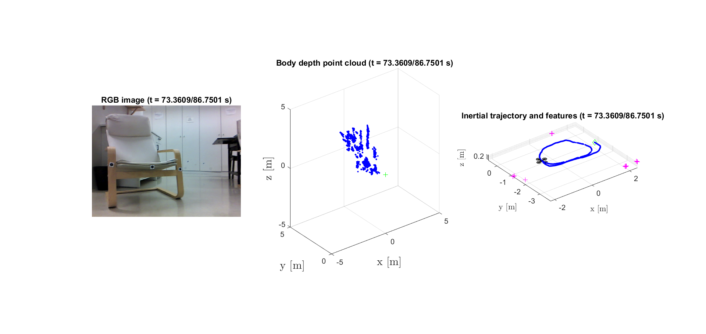

# Project Replace Dataset 1 for SLAMMOT algorithms

Authors: [Manuel Simas](https://www.linkedin.com/in/manuelsimas/), [Bruno J. Guerreiro](https://brunojnguerreiro.eu), [Pedro Batista](https://pbatista.weebly.com/)
Contact: <bguerreiro@isr.tecnico.ulisboa.pt>

## About this dataset

We release this dataset obtained within the scope of Project REPLACE (<http://replace.isr.tecnico.ulisboa.pt>), used in a paper being considered for publication in the Journal of Intelligent and Robotic Systems. The dataset is designed for validation of algorithms for simultaneous localization and mapping with moving object tracking (SLAMMOT).

The dataset includes MOCAP ground-truth and RGB-D camera data, in the form of a single [ROSBAG](http://wiki.ros.org/rosbag) file with ~8 GB size, available at:
1. Google drive: <https://drive.google.com/file/d/1HiKYGGFMMEVFt40XkEVDAvK1GRC4JLGB/view?usp=sharing>
2. Lab server: <http://users.isr.ist.utl.pt/~bguerreiro/rosbags/2019-07-10_SLAMMOT_Alameda.bag>

The code provided here reads the raw dataset, parses the data to identify the features and vehicle motion, and plots the resulting variables. To test the dataset, just clone the repository into your PC, and run the command `StartHere` in [MATLAB}(https://www.mathworks.com/products/matlab.html). 

Notes:
* The version used to test this code was MATLAB 2019b.
* If the ROSBAG file is not yet in the code folder, the script will try to download it from the above links, which given the size of the file might take a while.
* There might be memory issues when loading the dataset, even if the code tries to avoid them.

## Disclaimer

This code is provided "as is", without warranty of any kind, expressed or implied. 

## Acknowledgments

This work was partially funded by the FCT projects REPLACE (PTDC/EEI-AUT/32107/2017), CAPTURE (PTDC/EEI-AUT/1732/2020) and DECENTER (PTDC/EEI-AUT/29605/2017), which include Lisboa 2020 and PIDDAC funds, and also by projects LARSYS (UIDB/50009/2020) and CTS (UIDB/00066/2020).

## License

This work is licensed under a [Creative Commons Attribution-NonCommercial-ShareAlike 4.0 International License](
https://creativecommons.org/licenses/by-nc-sa/4.0).
